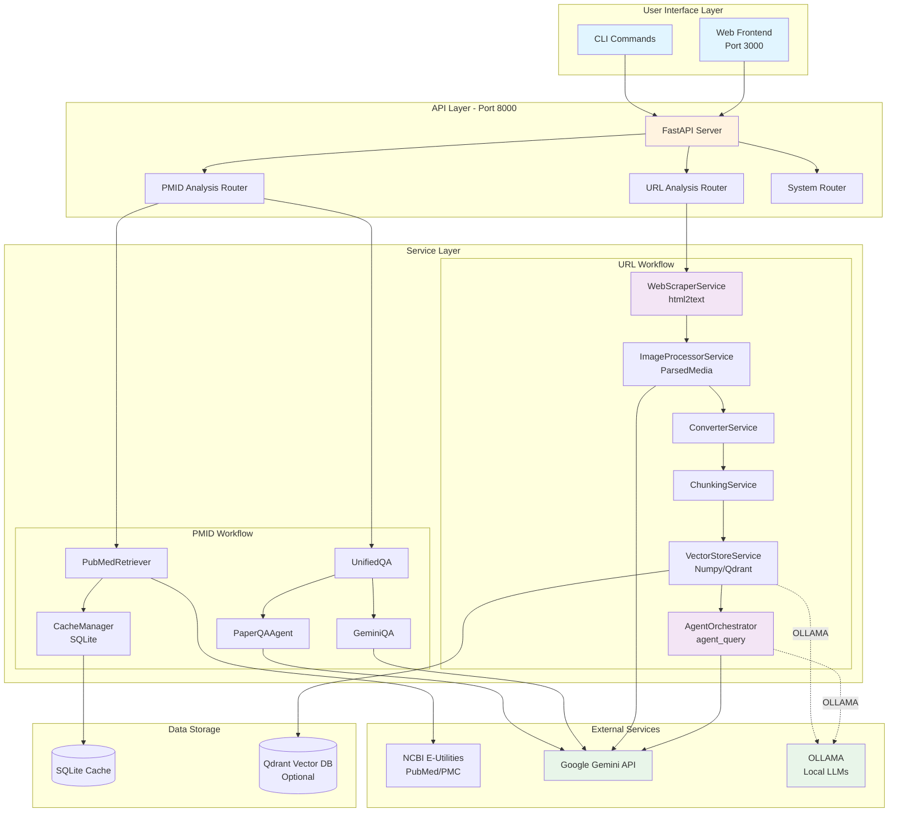
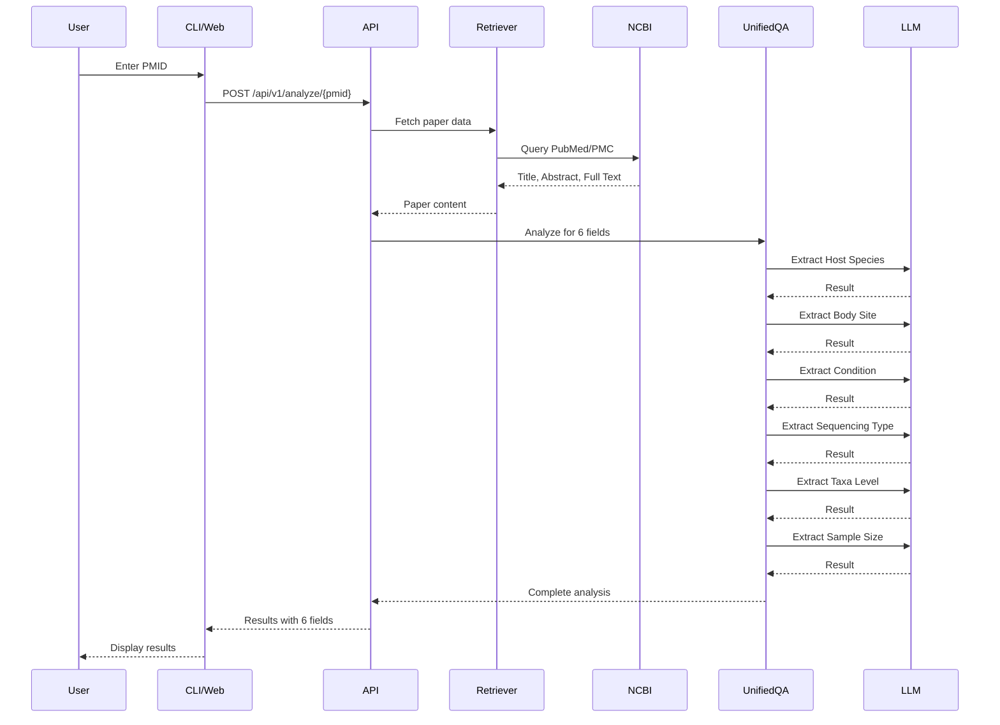
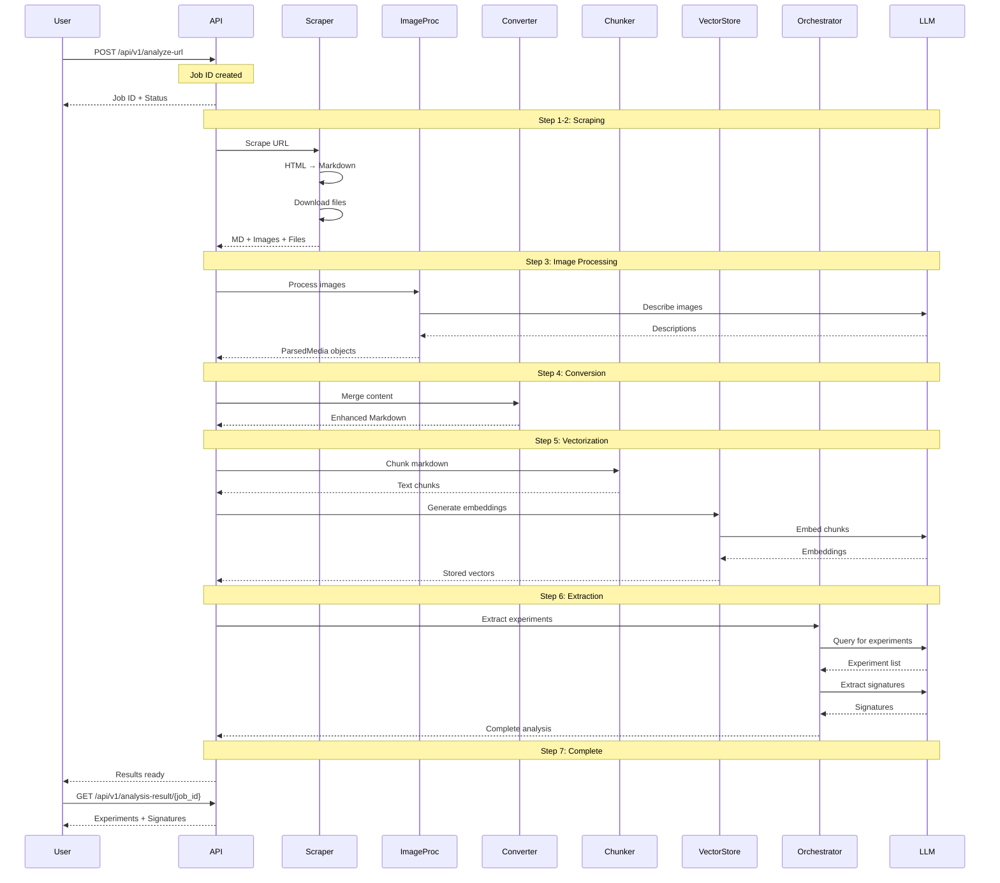
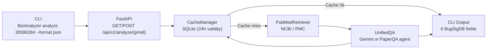
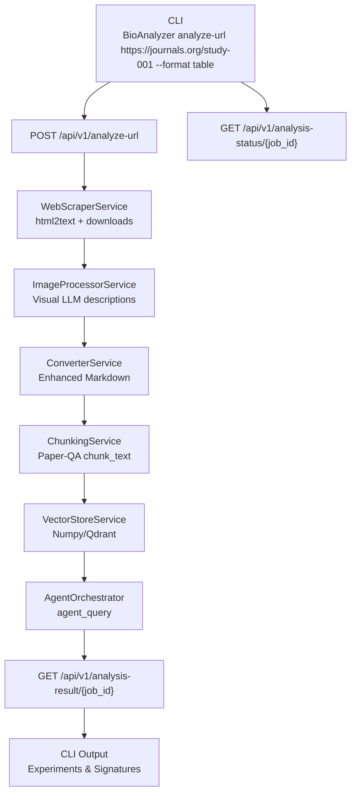

# BioAnalyzer - Complete Architecture & Flow Documentation

## Table of Contents
1. [System Overview](#system-overview)
2. [Architecture Diagram](#architecture-diagram)
3. [User Workflows](#user-workflows)
4. [Component Details](#component-details)
5. [Data Flow](#data-flow)
6. [CLI Commands Reference](#cli-commands-reference)
7. [API Endpoints](#api-endpoints)
8. [Performance Characteristics](#performance-characteristics)

---

## System Overview

**BioAnalyzer** is an AI-powered tool for analyzing scientific papers to determine their readiness for BugSigDB curation. It supports two primary workflows:

1. **PMID-based Analysis** (Original) - User enters PMID, LLM automatically extracts all required fields
2. **URL-based Analysis** (Enhanced) - User enters study URL, system scrapes, processes images, and extracts data

### Core Capabilities
- ✅ Automated extraction of 6 essential BugSigDB fields
- ✅ Visual LLM integration for image analysis
- ✅ Vector-based semantic search
- ✅ Agent-based orchestration for complex extraction
- ✅ Support for local (OLLAMA) and cloud (Gemini) LLMs

---

## Architecture Diagram



---

## User Workflows

### Workflow 1: PMID-Based Analysis (Simple)

**User Action:** Enter PMID → LLM does everything



**CLI Command:**
```bash
BioAnalyzer analyze 12345678
```

**Result:** User gets all 6 BugSigDB fields automatically extracted.

---

### Workflow 2: URL-Based Analysis (Enhanced - 7 Steps)

**User Action:** Enter URL → Complete automated workflow



**CLI Command (Sample URL):**
```bash
BioAnalyzer analyze-url https://journals.org/study-001 \
  --embedding-model gemini/text-embedding-004 \
  --llm-model gemini/gemini-2.0-flash \
  --format table
```

**REST Alternative:**
```bash
curl -X POST http://localhost:8000/api/v1/analyze-url \
  -H "Content-Type: application/json" \
  -d '{"url": "https://study-url.com"}'
```

---

## Component Details

### 1. Data Retrieval Layer

#### PubMedRetriever
- **Purpose:** Fetch paper data from NCBI
- **APIs Used:** E-utilities (esearch, efetch, esummary)
- **Caching:** SQLite-based cache to avoid redundant API calls
- **Output:** Title, Abstract, Full Text (when available)

#### WebScraperService
- **Purpose:** Scrape study URLs
- **Technology:** `html2text` (from Paper-QA) + `requests`
- **Features:**
  - HTML → Markdown conversion
  - Link extraction (images, files)
  - Async file downloading
  - Size limits (50MB default)

---

### 2. Processing Layer

#### ImageProcessorService
- **Purpose:** Process images for visual LLM
- **Technology:** Paper-QA's `ParsedMedia` class
- **Features:**
  - Image downloading and caching
  - `to_image_url()` for LLM input (base64 data URLs)
  - Visual LLM description generation

#### ConverterService
- **Purpose:** Merge all content into enhanced markdown
- **Features:**
  - Appends image descriptions
  - Extracts file content
  - Creates structured document

#### ChunkingService
- **Purpose:** Split text for vector storage
- **Technology:** Paper-QA's `chunk_text()` with tiktoken
- **Configuration:**
  - Default: 3000 chars per chunk
  - Overlap: 100 chars
  - Preserves media references

---

### 3. AI/LLM Layer

#### UnifiedQA
- **Purpose:** Unified interface for LLM interactions
- **Backends:**
  - `PaperQAAgent` (preferred) - Uses litellm
  - `GeminiQA` (fallback) - Direct Gemini API
- **New Feature:** `analyze_image()` for visual LLM

#### AgentOrchestrator
- **Purpose:** Orchestrate complex extraction workflows
- **Technology:** Paper-QA's `agent_query` system
- **Workflow:**
  1. Extract experiments (metadata)
  2. Extract signatures per experiment
  3. Validate and score results

---

### 4. Storage Layer

#### CacheManager (PMID Workflow)
- **Technology:** SQLite
- **Tables:**
  - `analysis_cache` - Analysis results
  - `paper_metadata` - Paper metadata
  - `full_text_cache` - Full text content

#### VectorStoreService (URL Workflow)
- **Options:**
  - `NumpyVectorStore` - In-memory (fast, simple)
  - `QdrantVectorStore` - Persistent (production)
- **Embeddings:**
  - Gemini: `text-embedding-004`
  - OLLAMA: `nomic-embed-text`
  - SentenceTransformer: `all-MiniLM-L6-v2`

---

## Data Flow

### PMID Analysis Data Flow

```
PMID Input
    ↓
PubMedRetriever
    ↓
[Check Cache]
    ↓ (miss)
NCBI API Call
    ↓
Parse XML Response
    ↓
Extract: Title, Abstract, Full Text
    ↓
[Store in Cache]
    ↓
UnifiedQA
    ↓
For each of 6 fields:
    ↓
LLM Query (Gemini/OLLAMA)
    ↓
Parse Response
    ↓
Validate & Score
    ↓
Aggregate Results
    ↓
Return JSON:
{
  "pmid": "...",
  "fields": {
    "host_species": {...},
    "body_site": {...},
    ...
  }
}
```

### URL Analysis Data Flow

```
URL Input
    ↓
WebScraperService
    ├→ HTML Fetch
    ├→ html2text Conversion
    ├→ Link Extraction
    └→ File Download
    ↓
{markdown, images[], files[]}
    ↓
ImageProcessorService
    ├→ Download Images
    ├→ Create ParsedMedia
    └→ Visual LLM Description
    ↓
ConverterService
    ├→ Merge Markdown
    ├→ Append Image Descriptions
    └→ Add File Content
    ↓
Enhanced Markdown
    ↓
ChunkingService
    ├→ Split by tiktoken
    └→ Create Text objects
    ↓
VectorStoreService
    ├→ Generate Embeddings
    └→ Store Vectors
    ↓
AgentOrchestrator
    ├→ Query: Find Experiments
    ├→ Extract: Metadata
    ├→ Query: Find Signatures
    └→ Validate Results
    ↓
StudyAnalysisResult:
{
  "experiments": [...],
  "signatures": [...],
  "curation_ready": true/false
}
```

---

## CLI Commands Reference

### Setup Commands

```bash
# Build Docker containers
BioAnalyzer build

# Start application
BioAnalyzer start

# Stop application
BioAnalyzer stop

# Restart application
BioAnalyzer restart

# Check system status
BioAnalyzer status
```

### Analysis Commands (PMID Workflow)

```bash
# Analyze single paper
BioAnalyzer analyze 12345678

# Analyze multiple papers
BioAnalyzer analyze 12345678,87654321

# Analyze from file
BioAnalyzer analyze --file pmids.txt

# With output format
BioAnalyzer analyze 12345678 --format json
BioAnalyzer analyze 12345678 --format csv
BioAnalyzer analyze 12345678 --format table

# Save to file
BioAnalyzer analyze 12345678 --output results.json
```

### Analysis Commands (URL Workflow)

```bash
# Analyze a single study URL
BioAnalyzer analyze-url https://journals.org/sample-study

# Analyze and save JSON output
BioAnalyzer analyze-url https://journals.org/sample-study --format json --output study.json

# Analyze from file with multiple URLs
BioAnalyzer analyze-url --file urls.txt --embedding-model ollama/nomic-embed-text
```

### Retrieval Commands

```bash
# Retrieve paper data
BioAnalyzer retrieve 12345678

# Retrieve multiple
BioAnalyzer retrieve 12345678,87654321

# From file
BioAnalyzer retrieve --file pmids.txt
```

### Q&A Commands

```bash
# Ask a question
BioAnalyzer qa "What is the microbiome?"

# Interactive mode
BioAnalyzer qa --interactive
BioAnalyzer qa  # Same as --interactive
```

### Information Commands

```bash
# Show help
BioAnalyzer help

# Show field information
BioAnalyzer fields
```

---

## Command-Oriented Flowcharts

### PMID CLI Flow (`BioAnalyzer analyze 30599284 --format json`)



### URL CLI Flow (`BioAnalyzer analyze-url https://journals.org/study-001 --format table`)



### Performance Timeline (`BioAnalyzer analyze 30599284`)

```mermaid
gantt
    dateFormat  s
    axisFormat  %Ss
    title PMID Workflow Performance (BioAnalyzer analyze 30599284)

    section Steps
    Cache lookup                 :done,    cache, 0,2
    PubMed metadata retrieval    :active,  pubmed, 2,10
    PMC full text (if available) :         pmc,   10,12
    Six-field LLM extraction     :         qa,    12,30
    Result aggregation           :         agg,   30,33
```



---

## API Endpoints

### PMID Analysis Endpoints

```http
# Analyze by PMID (GET or POST)
GET /api/v1/analyze/{pmid}
POST /api/v1/analyze/{pmid}

# Get field information
GET /api/v1/fields
GET /api/v1/fields/{field_name}
```

### URL Analysis Endpoints (New)

```http
# Start URL analysis
POST /api/v1/analyze-url
Body: {
  "url": "https://study-url.com",
  "embedding_model": "ollama/nomic-embed-text",
  "llm_model": "gemini/gemini-2.0-flash"
}

# Check analysis status
GET /api/v1/analysis-status/{job_id}

# Get analysis results
GET /api/v1/analysis-result/{job_id}
```

### System Endpoints

```http
# Health check
GET /health
GET /api/v1/health

# System metrics
GET /api/v1/metrics

# Configuration
GET /api/v1/config
```

---

## Performance Characteristics

### PMID Analysis Performance

| Metric | Value | Notes |
|--------|-------|-------|
| **Average Time** | 15-30s | Depends on full text availability |
| **Cache Hit** | <1s | Instant if cached |
| **API Calls** | 3-5 | NCBI + LLM calls |
| **Accuracy** | 85-95% | For well-structured papers |

**Bottlenecks:**
- NCBI API rate limits (3 requests/second)
- LLM response time (5-10s per field)
- Full text retrieval (when available)

### URL Analysis Performance

| Metric | Value | Notes |
|--------|-------|-------|
| **Average Time** | 60-120s | Full workflow |
| **Scraping** | 5-10s | HTML fetch + conversion |
| **Image Processing** | 10-30s | Depends on image count |
| **Vectorization** | 10-20s | Embedding generation |
| **Extraction** | 20-40s | Agent queries |

**Bottlenecks:**
- Image downloading (network speed)
- Visual LLM calls (5-10s per image)
- Vector embedding (depends on chunk count)
- Agent orchestration (multiple LLM calls)

### Optimization Strategies

1. **Caching:**
   - SQLite cache for PMID results
   - Image cache to avoid re-downloading
   - Vector store persistence

2. **Parallel Processing:**
   - Async image downloads
   - Batch embedding generation
   - Background job processing

3. **Local Models:**
   - OLLAMA for embeddings (faster, free)
   - Local SentenceTransformer models
   - Reduces API costs

---

## Technology Stack

### Backend
- **Framework:** FastAPI
- **Language:** Python 3.8+
- **LLM Integration:** litellm (via Paper-QA)
- **Vector Storage:** Numpy/Qdrant
- **Caching:** SQLite
- **Async:** aiohttp, asyncio

### Frontend
- **Framework:** React (orunos-main)
- **Port:** 3000

### External Services
- **NCBI E-Utilities:** PubMed/PMC data
- **Google Gemini:** LLM and embeddings
- **OLLAMA:** Local LLM option

### Paper-QA Integration
- `ParsedMedia` - Image handling
- `agent_query` - Orchestration
- `embedding_model_factory` - Embeddings
- `chunk_text` - Text chunking
- `NumpyVectorStore`/`QdrantVectorStore` - Vectors

---

## Deployment

### Docker Deployment

```bash
# Build
docker build -t bioanalyzer-backend .

# Run
docker run -d \
  --name bioanalyzer-api \
  -p 8000:8000 \
  -e GEMINI_API_KEY=your_key \
  -e NCBI_API_KEY=your_key \
  -e EMAIL=your@email.com \
  bioanalyzer-backend
```

### Environment Variables

```bash
# Required
GEMINI_API_KEY=your_gemini_api_key
NCBI_API_KEY=your_ncbi_api_key
EMAIL=your_email@example.com

# Optional
OLLAMA_HOST=http://localhost:11434
QDRANT_PATH=./qdrant_data
API_TIMEOUT=60
LOG_LEVEL=INFO
```

---

## Future Enhancements

1. **Streaming Progress + Notifications:**
   - Websocket updates for long-running URL jobs
   - Optional Slack / email notifications when jobs finish

2. **Batch URL Scheduler:**
   - Process multiple study URLs concurrently with retry policies
   - Persistent queue backed by Redis or Postgres

3. **Human-in-the-Loop Validation:**
   - Guided review UI for experiments/signatures
   - Export-ready BugSigDB submission packages

4. **Advanced Document Inputs:**
   - Direct PDF uploads with automatic parsing
   - Multilingual study detection & translation

---

## Summary

BioAnalyzer provides two complementary workflows:

1. **Simple PMID Input** → Automated field extraction (original)
2. **URL Input** → Complete study analysis with images (enhanced)

Both workflows leverage Paper-QA's proven patterns and support both cloud (Gemini) and local (OLLAMA) LLMs, providing flexibility for different use cases and deployment scenarios.

The system is designed to be:
- **User-friendly:** Simple CLI commands
- **Flexible:** Multiple LLM options
- **Efficient:** Caching and async processing
- **Extensible:** Modular architecture
- **Production-ready:** Docker deployment, health checks, monitoring
