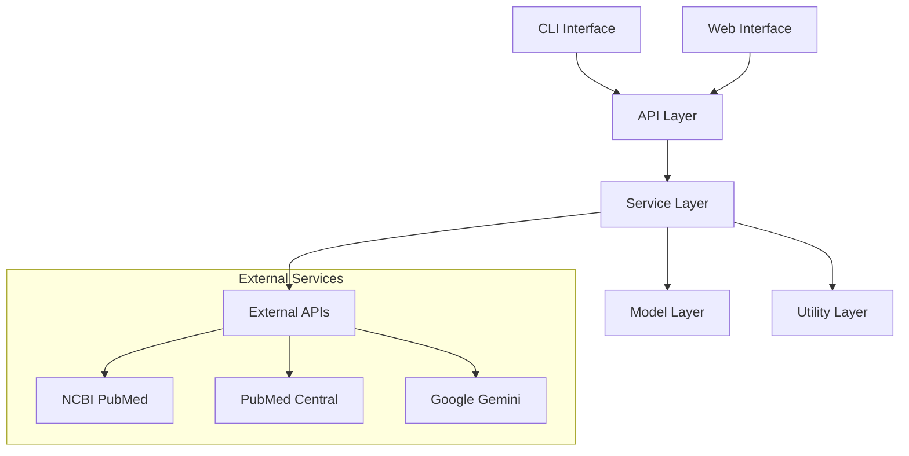
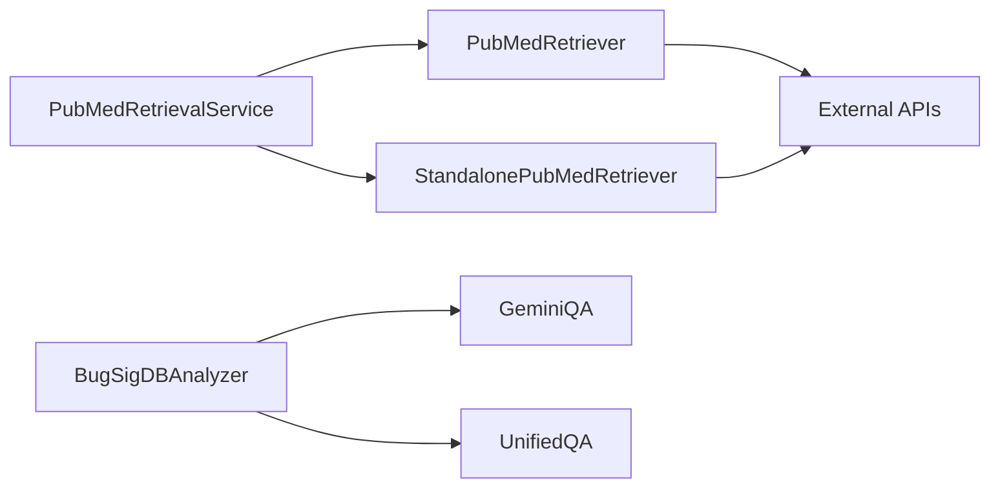

# BioAnalyzer Backend Architecture Documentation

## Table of Contents

1. [System Overview](#system-overview)
2. [Architecture Principles](#architecture-principles)
3. [Component Architecture](#component-architecture)
4. [Data Flow](#data-flow)
5. [Service Layer Design](#service-layer-design)
6. [API Design](#api-design)
7. [CLI Architecture](#cli-architecture)
8. [Error Handling Strategy](#error-handling-strategy)
9. [Performance Considerations](#performance-considerations)
10. [Security Architecture](#security-architecture)
11. [Deployment Architecture](#deployment-architecture)
12. [Monitoring and Observability](#monitoring-and-observability)

## System Overview

BioAnalyzer Backend is a microservices-oriented system designed for scientific paper analysis and retrieval. The system follows a layered architecture pattern with clear separation of concerns.

### Core Responsibilities

- **Paper Retrieval**: Fetch metadata and full text from PubMed/PMC
- **Field Analysis**: Extract 6 essential BugSigDB fields using AI
- **Data Processing**: Transform and validate retrieved data
- **API Services**: Provide RESTful endpoints for external consumption
- **CLI Interface**: Command-line tools for direct user interaction

### System Characteristics

- **Scalable**: Horizontal scaling through containerization
- **Maintainable**: Modular design with clear interfaces
- **Resilient**: Comprehensive error handling and fallback mechanisms
- **Observable**: Built-in monitoring and logging capabilities
- **Extensible**: Plugin architecture for new analysis methods

## Architecture Principles

### 1. Separation of Concerns

Each layer has distinct responsibilities:

```
┌─────────────────────────────────────────┐
│           Presentation Layer            │
│  (CLI, Web Interface, API Endpoints)    │
├─────────────────────────────────────────┤
│            Service Layer                │
│  (Business Logic, Orchestration)        │
├─────────────────────────────────────────┤
│            Data Layer                   │
│  (Retrieval, Storage, Caching)          │
├─────────────────────────────────────────┤
│          Infrastructure Layer           │
│  (Configuration, Logging, Monitoring)   │
└─────────────────────────────────────────┘
```

### 2. Dependency Inversion

High-level modules don't depend on low-level modules. Both depend on abstractions.

### 3. Single Responsibility

Each component has one reason to change.

### 4. Open/Closed Principle

Open for extension, closed for modification.

## Component Architecture

### Core Components

#### 1. API Layer (`app/api/`)

**Purpose**: Handle HTTP requests and responses

**Components**:
- `app.py`: FastAPI application instance
- `routers/`: Route handlers for different endpoints
- `models/`: Pydantic models for request/response validation
- `utils/`: API-specific utilities

**Responsibilities**:
- Request validation and parsing
- Response formatting
- Authentication and authorization
- Rate limiting
- Error handling and logging

#### 2. Service Layer (`app/services/`)

**Purpose**: Implement business logic and orchestrate operations

**Components**:
- `data_retrieval.py`: Core PubMed data retrieval
- `pubmed_retrieval_service.py`: High-level retrieval service
- `standalone_pubmed_retriever.py`: Lightweight standalone retriever
- `bugsigdb_analyzer.py`: Field analysis and extraction
- `cache_manager.py`: Caching and performance optimization

**Responsibilities**:
- Business logic implementation
- Data transformation and validation
- External service integration
- Caching strategies
- Error handling and recovery

#### 3. Model Layer (`app/models/`)

**Purpose**: AI models and analysis engines

**Components**:
- `gemini_qa.py`: Google Gemini AI integration
- `unified_qa.py`: Unified question-answering system
- `conversation_model.py`: Conversational AI capabilities
- `config.py`: Model configuration and management

**Responsibilities**:
- AI model integration
- Text analysis and processing
- Field extraction algorithms
- Confidence scoring
- Model performance optimization

#### 4. Utility Layer (`app/utils/`)

**Purpose**: Shared utilities and helper functions

**Components**:
- `config.py`: Configuration management
- `text_processing.py`: Text manipulation utilities
- `performance_logger.py`: Performance monitoring
- `field_validator.py`: Data validation
- `methods_scorer.py`: Quality scoring algorithms

**Responsibilities**:
- Configuration management
- Text processing utilities
- Performance monitoring
- Data validation
- Helper functions

### Component Interactions



## Data Flow

### 1. Paper Analysis Flow

```
User Input (PMID) 
    ↓
CLI/API Validation
    ↓
PubMedRetriever.fetch_paper_metadata()
    ↓
PubMedRetriever.get_pmc_fulltext()
    ↓
BugSigDBAnalyzer.analyze_paper()
    ↓
GeminiQA Field Extraction
    ↓
Result Processing & Validation
    ↓
Response Formatting
    ↓
User Output (JSON/CSV/Table)
```

### 2. Batch Processing Flow

```
Batch Input (Multiple PMIDs)
    ↓
Input Validation & Deduplication
    ↓
Concurrent Processing (asyncio.gather)
    ↓
Individual Paper Processing
    ↓
Result Aggregation
    ↓
Progress Reporting
    ↓
Batch Output
```

### 3. Error Handling Flow

```
Request Processing
    ↓
Try Primary Method
    ↓
Success? → Return Result
    ↓
No → Log Error
    ↓
Try Fallback Method
    ↓
Success? → Return Partial Result
    ↓
No → Return Error Response
```

## Service Layer Design

### Service Architecture Pattern

Each service follows a consistent pattern:

```python
class ServiceName:
    def __init__(self, dependencies):
        # Initialize dependencies
        pass
    
    async def primary_method(self, params):
        # Main business logic
        pass
    
    def _helper_method(self, params):
        # Internal helper methods
        pass
    
    def _validate_input(self, params):
        # Input validation
        pass
    
    def _handle_error(self, error):
        # Error handling
        pass
```

### Service Dependencies



### Service Interfaces

#### PubMedRetriever Interface

```python
class PubMedRetriever:
    def fetch_paper_metadata(self, pmid: str) -> Dict[str, Any]
    def get_pmc_fulltext(self, pmid: str) -> str
    def get_full_paper_data(self, pmid: str) -> Dict[str, Any]
    def search(self, query: str, max_results: int = 10) -> List[str]
```

#### PubMedRetrievalService Interface

```python
class PubMedRetrievalService:
    async def retrieve_paper(self, pmid: str, save_to_file: bool = False) -> Dict[str, Any]
    async def retrieve_multiple_papers(self, pmids: List[str], save_to_file: bool = False) -> List[Dict[str, Any]]
    def format_paper_summary(self, paper_data: Dict[str, Any]) -> str
    def get_paper_stats(self, paper_data: Dict[str, Any]) -> Dict[str, Any]
```

## API Design

### RESTful API Principles

- **Resource-based URLs**: `/api/v1/analyze/{pmid}`
- **HTTP Methods**: GET for retrieval, POST for creation
- **Status Codes**: Proper HTTP status codes
- **Content Negotiation**: JSON responses with proper headers
- **Error Responses**: Consistent error format

### API Endpoints

#### Analysis Endpoints

```http
GET /api/v1/analyze/{pmid}
POST /api/v1/analyze/batch
GET /api/v1/fields
```

#### Retrieval Endpoints

```http
GET /api/v1/retrieve/{pmid}
POST /api/v1/retrieve/batch
GET /api/v1/retrieve/search
```

#### System Endpoints

```http
GET /health
GET /metrics
GET /docs
```

### Request/Response Models

#### Analysis Request
```python
class AnalysisRequest(BaseModel):
    pmid: str
    include_full_text: bool = True
    format: str = "json"
```

#### Analysis Response
```python
class AnalysisResponse(BaseModel):
    pmid: str
    title: str
    fields: Dict[str, FieldResult]
    curation_summary: str
    processing_time: float
    timestamp: datetime
```

### API Error Handling

```python
class APIError(BaseModel):
    error_code: str
    message: str
    details: Optional[Dict[str, Any]] = None
    timestamp: datetime
```

## CLI Architecture

### CLI Design Principles

- **Command-based**: Clear command structure
- **Subcommand Support**: Nested commands for organization
- **Help System**: Comprehensive help and documentation
- **Error Handling**: User-friendly error messages
- **Output Formats**: Multiple output options

### CLI Command Structure

```
BioAnalyzer
├── build                    # Build containers
├── start                    # Start application
├── stop                     # Stop application
├── restart                  # Restart application
├── status                   # Check system status
├── analyze                  # Analyze papers
│   ├── <pmid>              # Single paper
│   ├── <pmid1,pmid2>       # Multiple papers
│   └── --file <file>       # From file
├── retrieve                 # Retrieve papers
│   ├── <pmid>              # Single paper
│   ├── <pmid1,pmid2>       # Multiple papers
│   ├── --file <file>       # From file
│   ├── --save              # Save individual files
│   ├── --format <format>   # Output format
│   └── --output <file>     # Save to file
└── fields                   # Show field information
```

### CLI Implementation Pattern

```python
class BioAnalyzerCLI:
    def __init__(self):
        # Initialize CLI components
        pass
    
    def _create_parser(self):
        # Create argument parser
        pass
    
    def _handle_command(self, args):
        # Route to appropriate handler
        pass
    
    def _validate_input(self, args):
        # Validate command arguments
        pass
    
    def _format_output(self, results, format_type):
        # Format output based on type
        pass
```

## Error Handling Strategy

### Error Classification

1. **Network Errors**: Connection timeouts, DNS failures
2. **API Errors**: Rate limiting, authentication failures
3. **Data Errors**: Invalid PMIDs, parsing failures
4. **System Errors**: Memory issues, disk space
5. **Business Logic Errors**: Invalid parameters, missing data

### Error Handling Patterns

#### Retry Pattern
```python
def retry_with_backoff(func, max_retries=3, backoff_factor=2):
    for attempt in range(max_retries):
        try:
            return func()
        except RetryableError as e:
            if attempt < max_retries - 1:
                time.sleep(backoff_factor ** attempt)
                continue
            raise
```

#### Circuit Breaker Pattern
```python
class CircuitBreaker:
    def __init__(self, failure_threshold=5, timeout=60):
        self.failure_threshold = failure_threshold
        self.timeout = timeout
        self.failure_count = 0
        self.last_failure_time = None
        self.state = "CLOSED"  # CLOSED, OPEN, HALF_OPEN
```

#### Fallback Pattern
```python
def get_paper_data_with_fallback(pmid):
    try:
        return primary_retriever.get_data(pmid)
    except PrimaryError:
        try:
            return fallback_retriever.get_data(pmid)
        except FallbackError:
            return create_error_response(pmid)
```

### Error Response Format

```python
class ErrorResponse(BaseModel):
    error_code: str
    message: str
    details: Optional[Dict[str, Any]]
    timestamp: datetime
    request_id: str
    suggestions: Optional[List[str]]
```

## Performance Considerations

### Caching Strategy

#### Multi-Level Caching

1. **Memory Cache**: In-process caching for frequently accessed data
2. **Redis Cache**: Distributed caching for multi-instance deployments
3. **File Cache**: Persistent caching for large datasets

#### Cache Invalidation

- **TTL-based**: Time-to-live expiration
- **Event-based**: Invalidation on data updates
- **Manual**: Administrative cache clearing

### Async Processing

#### Concurrent Operations

```python
async def process_multiple_papers(pmids):
    tasks = [process_single_paper(pmid) for pmid in pmids]
    results = await asyncio.gather(*tasks, return_exceptions=True)
    return results
```

#### Resource Pooling

- **Connection Pools**: HTTP connection reuse
- **Thread Pools**: CPU-intensive task execution
- **Process Pools**: Parallel processing for heavy workloads

### Performance Monitoring

#### Metrics Collection

- **Response Times**: API endpoint performance
- **Throughput**: Requests per second
- **Error Rates**: Failure percentages
- **Resource Usage**: CPU, memory, disk usage

#### Performance Optimization

- **Lazy Loading**: Load data only when needed
- **Pagination**: Handle large datasets efficiently
- **Compression**: Reduce network payload size
- **CDN**: Content delivery for static assets

## Security Architecture

### Authentication and Authorization

#### API Key Management

```python
class APIKeyManager:
    def validate_key(self, key: str) -> bool:
        # Validate API key format and permissions
        pass
    
    def get_rate_limits(self, key: str) -> Dict[str, int]:
        # Get rate limits for API key
        pass
```

#### Rate Limiting

```python
class RateLimiter:
    def __init__(self, requests_per_minute: int):
        self.requests_per_minute = requests_per_minute
        self.requests = {}
    
    def is_allowed(self, client_id: str) -> bool:
        # Check if client is within rate limits
        pass
```

### Data Security

#### Input Validation

- **Sanitization**: Clean user inputs
- **Validation**: Verify data formats and ranges
- **Escaping**: Prevent injection attacks

#### Output Encoding

- **JSON Encoding**: Proper JSON serialization
- **HTML Encoding**: Prevent XSS attacks
- **SQL Escaping**: Prevent SQL injection

### Network Security

#### HTTPS/TLS

- **Certificate Management**: SSL/TLS certificates
- **Cipher Suites**: Strong encryption algorithms
- **HSTS**: HTTP Strict Transport Security

#### CORS Configuration

```python
app.add_middleware(
    CORSMiddleware,
    allow_origins=["https://example.com"],
    allow_credentials=True,
    allow_methods=["GET", "POST"],
    allow_headers=["*"],
)
```

## Deployment Architecture

### Container Architecture

#### Docker Services

```yaml
services:
  api:
    build: .
    ports:
      - "8000:8000"
    environment:
      - GEMINI_API_KEY=${GEMINI_API_KEY}
      - NCBI_API_KEY=${NCBI_API_KEY}
    depends_on:
      - redis
      - postgres
  
  redis:
    image: redis:alpine
    ports:
      - "6379:6379"
  
  postgres:
    image: postgres:13
    environment:
      - POSTGRES_DB=bioanalyzer
      - POSTGRES_USER=user
      - POSTGRES_PASSWORD=password
    volumes:
      - postgres_data:/var/lib/postgresql/data
```

#### Multi-Stage Builds

```dockerfile
# Build stage
FROM python:3.9-slim as builder
COPY requirements.txt .
RUN pip install --no-cache-dir -r requirements.txt

# Runtime stage
FROM python:3.9-slim
COPY --from=builder /usr/local/lib/python3.9/site-packages /usr/local/lib/python3.9/site-packages
COPY . /app
WORKDIR /app
CMD ["python", "main.py"]
```

### Orchestration

#### Docker Compose

- **Development**: Hot reloading, debug tools
- **Testing**: Isolated test environment
- **Production**: Optimized for performance

#### Kubernetes (Future)

- **Horizontal Scaling**: Auto-scaling based on load
- **Service Discovery**: Dynamic service registration
- **Load Balancing**: Traffic distribution
- **Health Checks**: Automatic failure detection

### Environment Management

#### Configuration Management

```python
class Config:
    def __init__(self):
        self.environment = os.getenv("ENVIRONMENT", "development")
        self.load_config()
    
    def load_config(self):
        if self.environment == "production":
            self.load_production_config()
        else:
            self.load_development_config()
```

#### Secrets Management

- **Environment Variables**: Runtime configuration
- **Secret Stores**: Encrypted secret storage
- **Key Rotation**: Regular key updates

## Monitoring and Observability

### Logging Architecture

#### Structured Logging

```python
import structlog

logger = structlog.get_logger()

logger.info(
    "paper_analyzed",
    pmid="12345678",
    processing_time=2.5,
    fields_extracted=6,
    confidence_score=0.92
)
```

#### Log Levels

- **DEBUG**: Detailed diagnostic information
- **INFO**: General information about system operation
- **WARNING**: Warning messages for potential issues
- **ERROR**: Error messages for failed operations
- **CRITICAL**: Critical errors requiring immediate attention

### Metrics Collection

#### Application Metrics

```python
from prometheus_client import Counter, Histogram, Gauge

# Counters
requests_total = Counter('http_requests_total', 'Total HTTP requests', ['method', 'endpoint'])
errors_total = Counter('errors_total', 'Total errors', ['error_type'])

# Histograms
request_duration = Histogram('http_request_duration_seconds', 'HTTP request duration')

# Gauges
active_connections = Gauge('active_connections', 'Number of active connections')
```

#### System Metrics

- **CPU Usage**: Processor utilization
- **Memory Usage**: RAM consumption
- **Disk Usage**: Storage utilization
- **Network I/O**: Network traffic

### Health Checks

#### Liveness Probe

```python
@app.get("/health/live")
async def liveness_check():
    return {"status": "alive", "timestamp": datetime.utcnow()}
```

#### Readiness Probe

```python
@app.get("/health/ready")
async def readiness_check():
    checks = {
        "database": check_database_connection(),
        "redis": check_redis_connection(),
        "external_apis": check_external_apis()
    }
    
    if all(checks.values()):
        return {"status": "ready", "checks": checks}
    else:
        raise HTTPException(status_code=503, detail="Service not ready")
```

### Alerting

#### Alert Rules

```yaml
groups:
  - name: bioanalyzer
    rules:
      - alert: HighErrorRate
        expr: rate(errors_total[5m]) > 0.1
        for: 2m
        labels:
          severity: warning
        annotations:
          summary: "High error rate detected"
      
      - alert: ServiceDown
        expr: up == 0
        for: 1m
        labels:
          severity: critical
        annotations:
          summary: "Service is down"
```

#### Notification Channels

- **Email**: Critical alerts
- **Slack**: Team notifications
- **PagerDuty**: On-call alerts
- **Webhooks**: Custom integrations

## Future Enhancements

### Planned Improvements

1. **Microservices Architecture**: Split into smaller, focused services
2. **Event-Driven Architecture**: Implement event streaming
3. **Machine Learning Pipeline**: Automated model training and deployment
4. **GraphQL API**: More flexible query interface
5. **Real-time Processing**: WebSocket-based real-time updates

### Scalability Roadmap

1. **Horizontal Scaling**: Multi-instance deployment
2. **Database Sharding**: Distribute data across multiple databases
3. **CDN Integration**: Global content delivery
4. **Edge Computing**: Deploy closer to users
5. **Auto-scaling**: Dynamic resource allocation

---

This architecture documentation provides a comprehensive overview of the BioAnalyzer Backend system design, implementation patterns, and operational considerations. It serves as a guide for developers, operators, and stakeholders to understand the system's structure and capabilities.
